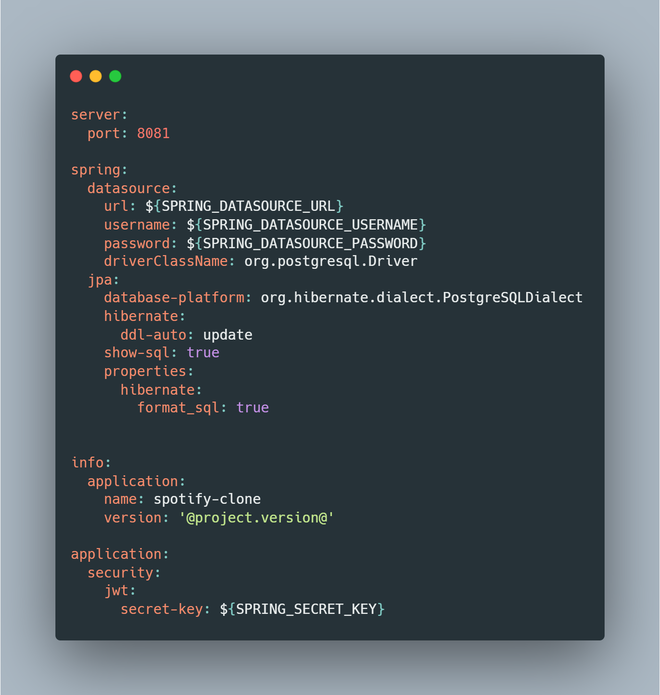
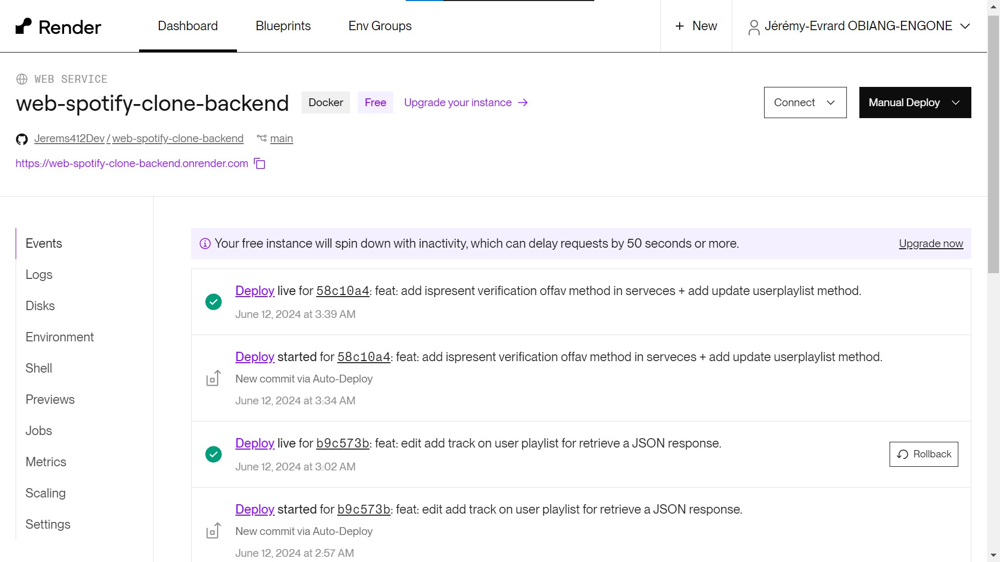
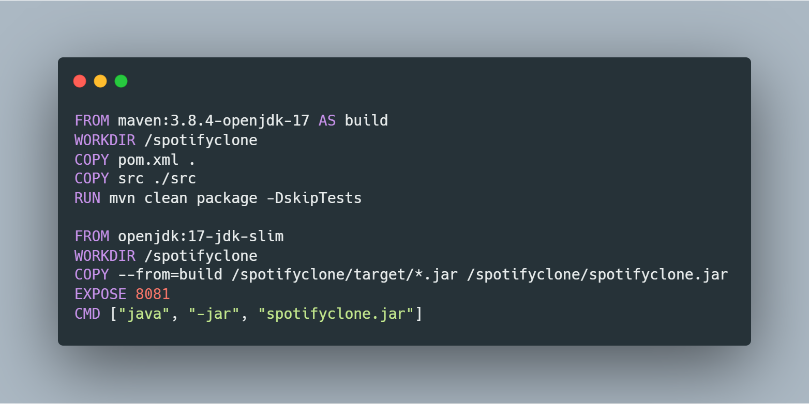
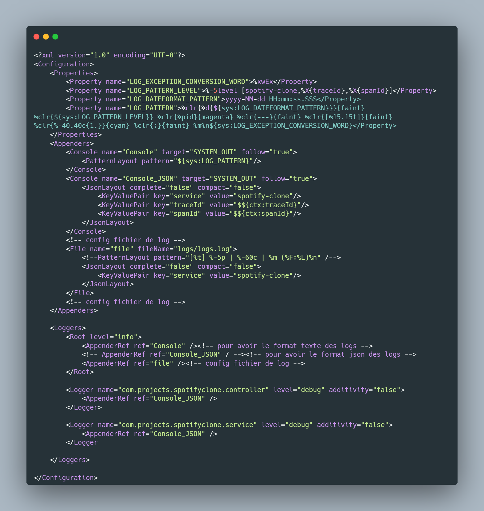
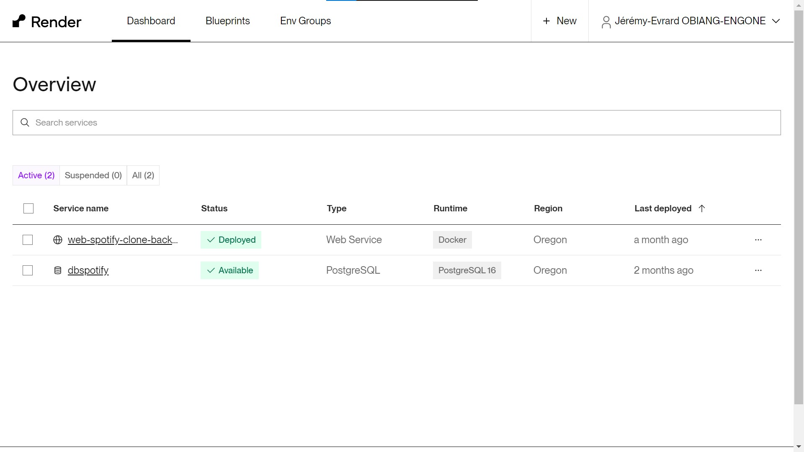
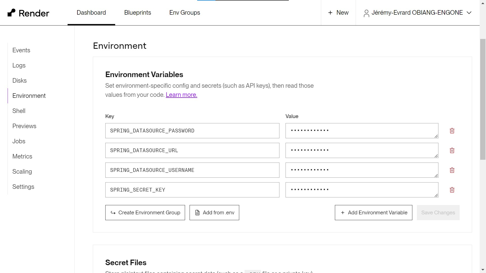
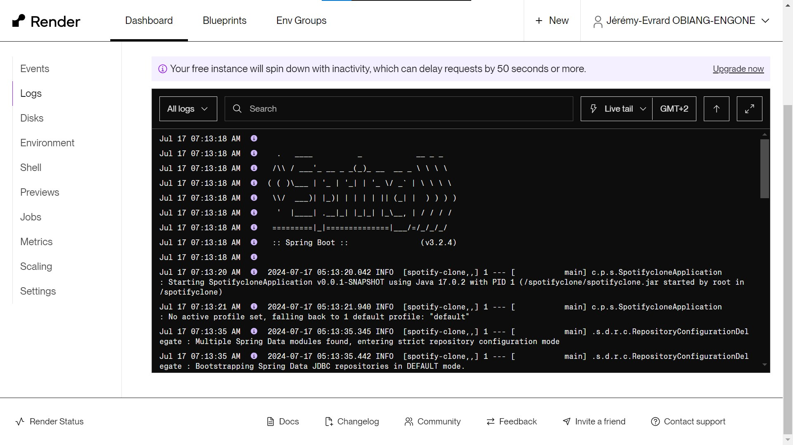

# Backend fo web spotify clone

This is a solution to the backend of my web spotify clone
## Table of contents

- [Overview](#overview)
  - [The challenge](#the-challenge)
  - [Screenshot](#screenshot)
  - [Links](#links)
- [My process](#my-process)
  - [Built with](#built-with)
  - [What I learned](#what-i-learned)
  - [Continued development](#continued-development)
- [Author](#author)

## Overview

### The challenge

Users should be able to:
- Register: Create a new user account by sending a RegisterDTO object to the /auth/register endpoint.
- Login: Authenticate using a LoginDTO object to the /auth/login endpoint, which will return a JSON Web Token (JWT) if the credentials are valid.
- Manage Album, Artist, Categories, SpotifyPlaylist, Track, TrackListen, UserPlaylist: Perform various operations on all entities, create,find etc

### Screenshot

### Links

- Solution URL: [Add solution URL here](https://github.com/Jerems412Dev/web-spotify-clone-backend)
- Live Site URL: [Add live site URL here](https://web-spotify-clone-4eml.vercel.app/)

## My process

### Built with

- Java - Spring Boot

## Author

- LinkedIn - [Jérémy-Evrard OBIANG-ENGONE](https://www.linkedin.com/in/j%C3%A9r%C3%A9my-evrard-obiang-engone-257436247/)
- Twitter - [Check out Jerems✪🇬🇦 @jeremsOb ](https://x.com/jeremsOb?t=tuX8ctBHgo2b5buKLmVXXA&s=08)
